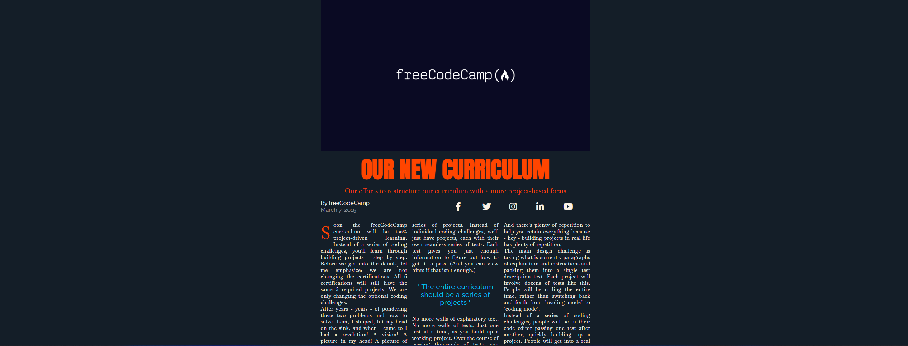

# FreeCodeCamp Course: Responsive Web Design 

<h1 align="center"> </h1>

**About this Project:**

This project is the creation of a website in the format of an old magazine.
In this project some divisions were made using display grid and its derived elements to generate measures, another way used to generate columns and measures was with column-width.

**Technologies**

- HTML
- CSS

**Course Link:**

https://www.freecodecamp.org/learn/2022/responsive-web-design/